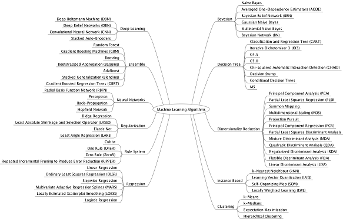

# Data Science

## Machine Learning
### Supervised
1. Classification
1. Regression
### Un-Supervised
1. Clustering

## Understand the problem
* Output : Success metric (e.g. Mean Absolute Error)

## Collect data
* Input : urls, csvs
* Methods : Web-Scraping, Pandas manipulation
* Output : Unstructured Data

## Import data
* Input : Unstructured Data
* Output : DataFrame + Corpus (if text data)

## Process data
* Actions :
    * Handle missing values,
    * Dummy variables for categorical data,
    * Remove redundant samples
    * Scale feature values of continuous data
* Output : DataFrame + Corpus (if text data)

## Analyze data
* Input : DataFrame + Corpus (if text data)
* Perform EDA (Exploratory Data Analysis)

## Clean data
* Actions : Standardize, text to vector
* Next step : Re-analyze data

## Model data

1. Regression Algorithms
    + Ordinary Least Squares Regression (OLSR)
    + Linear Regression
    + Logistic Regression
    + Stepwise Regression
    + Multivariate Adaptive Regression Splines (MARS)
    + Locally Estimated Scatterplot Smoothing (LOESS)

2. Instance-based Algorithms
    + k-Nearest Neighbour (kNN)
    + Learning Vector Quantization (LVQ)
    + Self-Organizing Map (SOM)
    + Locally Weighted Learning (LWL)

3. Regularization Algorithms
    + Ridge Regression
    + Least Absolute Shrinkage and Selection Operator (LASSO)
    + Elastic Net
    + Least-Angle Regression (LARS)

4. Decision Tree Algorithms
    + Classification and Regression Tree (CART)
    + Iterative Dichotomiser 3 (ID3)
    + C4.5 and C5.0 (different versions of a powerful approach)
    + Chi-squared Automatic Interaction Detection (CHAID)
    + Decision Stump
    + M5
    + Conditional Decision Trees

5. Bayesian Algorithms
    + Naive Bayes
    + Gaussian Naive Bayes
    + Multinomial Naive Bayes
    + Averaged One-Dependence Estimators (AODE)
    + Bayesian Belief Network (BBN)
    + Bayesian Network (BN)

6. Clustering Algorithms
    + k-Means
    + k-Medians
    + Expectation Maximisation (EM)
    + Hierarchical Clustering

7. Association Rule Learning Algorithms
    + Apriori algorithm
    + Eclat algorithm

8. Artificial Neural Network Algorithms
    + Perceptron
    + Back-Propagation
    + Hopfield Network
    + Radial Basis Function Network (RBFN)

9. Deep Learning Algorithms
    + Deep Boltzmann Machine (DBM)
    + Deep Belief Networks (DBN)
    + Convolutional Neural Network (CNN)
    + Stacked Auto-Encoders

10. Dimensionality Reduction Algorithms
    + Principal Component Analysis (PCA)
    + Principal Component Regression (PCR)
    + Partial Least Squares Regression (PLSR)
    + Sammon Mapping
    + Multidimensional Scaling (MDS)
    + Projection Pursuit
    + Linear Discriminant Analysis (LDA)
    + Mixture Discriminant Analysis (MDA)
    + Quadratic Discriminant Analysis (QDA)
    + Flexible Discriminant Analysis (FDA)

11. Ensemble Algorithms
    + Boosting
    + Bootstrapped Aggregation (Bagging)
    + AdaBoost
    + Stacked Generalization (blending)
    + Gradient Boosting Machines (GBM)
    + Gradient Boosted Regression Trees (GBRT)
    + Random Forest

12. Other Algorithms
    + Computational intelligence (evolutionary algorithms, etc.)
    + Computer Vision (CV)
    + Natural Language Processing (NLP)
    + Recommender Systems
    + Reinforcement Learning
    + Graphical Models

### Model Decision
+ is data labelled?
+ is data categorical or continuous?

## Report data product
+ Input : Model output
+ Output : Predictions, Decisions, Visualizations

